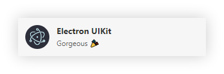
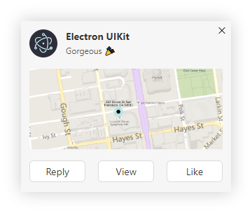

# @electron-uikit/notification


Notification for Electron app.

Windows notifications are not very nice and friendly, which is the motivation for designing this library. In Windows, notifications based on the implementation of the Electron window are used. In other platforms such as macOS, Electron notifications will still be used, so it can be used on any platform.

|                Default                |                   Customization                   |
| :-----------------------------------: | :-----------------------------------------------: |
|  |  |

## Features

- MacOS notifications styles
- Keep only one window and automatically update notifications
- Supports hover stay
- Supports dark mode
- Fully customizable
- Compatible with Windows, MacOS and Linux.

## Usage

### Install

```sh
npm i @electron-uikit/core @electron-uikit/notification
```

### Get Started

#### Using the notification in the main process.

```js
import { join } from 'path'
import { notification } from '@electron-uikit/notification'

notification.config({
  /**
   * Time in milliseconds before notification is closed and
   * should be greater then 2000. Defaults to 5000.
   */
  duration: 10000,
  /**
   * Default icon for the notification.
   */
  icon: join(__dirname, '../.../resources/icon.png')
  //...
})

// Only supports listening in the main process
notification.on('click', (data) => {
  if (data.type === 1) {
    //...
  }
  if (data.type === 2) {
    //...
  }
  // ...
})

notification.show({
  title: 'Electron UIKit',
  body: 'Gorgeous',
  extraData: { type: 1 } // click event data
})
```

#### Using the notification in the renderer process.

1. Exposes the UI Kit APIs for components. See [@electron-uikit/core](https://github.com/alex8088/electron-uikit/tree/main/packages/core) guide for more details.

   You can expose it in the specified preload script:

   ```js
   import { exposeUIKit } from '@electron-uikit/core/preload'

   exposeUIKit()
   ```

   Or, you can expose it globally in the main process for all renderer processes:

   ```js
   import { useUIKit } from '@electron-uikit/core/main'

   useUIKit()
   ```

> [!NOTE]
> If you are using [@electron-toolkit/preload](https://github.com/alex8088/electron-toolkit/tree/master/packages/preload) to expose Electron APIs, there is no need to use this module, because `core` is also an export of it.

2. Register a listener in the main process, so that you can use it in the renderer process.

   ```js
   import { app } from 'electron'
   import { registerNotificationListener } from '@electron-uikit/notification'

   app.whenReady().then(() => {
     // Register notification IPC listeners
     registerNotificationListener()

     // ...
   })
   ```

3. Use the notification in the renderer process.

   ```js
   import { notification } from '@electron-uikit/notification/renderer'

   notification.show({
     title: 'Electron UIKit',
     body: '🎉🌈'
   })
   ```

## APIs

### `.config(options)`

Configure notification defaults or customize notification windows. Can only be used in the main process.

- options: `object`

  - **title**: `string` (optional) - Default title for the notification. It can also be overridden by the title option of the show method. Defaults to [app.name](https://www.electronjs.org/zh/docs/latest/api/app#appname).
  - **icon**: `string` | `Electron.NativeImage` (optional) - Default icon for the notification, which can be an icon path, url protocol or [Electron NativeImage](https://www.electronjs.org/zh/docs/latest/api/native-image) object. It can also be overridden by the icon option of the show method.
  - **offset**: `number` (optional) _Windows_ - Notification window is offset from the bottom and right side.
  - **duration**: `number` (optional) _Windows_ - Time in milliseconds before notification is closed and should be greater then 2000. Defaults to 5000.
  - **customPage**：`string` (optional) _Windows_ - Custom html page loaded by notification window. It should be an absolute path.
  - **width**: `number` (optional) _Windows_ - Custom notification window width. Only valid if `customPage` has a value.
  - **height**: `number` (optional) _Windows_ - Custom notification window height. Only valid if `customPage` has a value.
  - **debug**: `boolean` (optional) _Windows_ - When set to `true`, it will open the devTool for debugging custom notification window. You should not enable this in production.

### `.show(info)`

Immediately shows the notification to the user. On Windows, if the notification has been shown before, this method will re-render the notification window and continue to display it. For other platforms, see [Electron's Notification Guide](https://www.electronjs.org/docs/latest/api/notification) for more details.

- info: `object`

  - **title**: `string` (optional) - A title for the notification, which will be shown at the top of the notification window when it is shown.
  - **body**: `string` (optional) - The body text of the notification, which will be displayed below the title.
  - **icon**: `string` | `Electron.NativeImage` (optional) - An icon to use in the notification. NativeImage icon is not supported in the renderer process.
  - **extraData**: `any` (optional) - Extra data for click events.

### `.destroy()`

Dismiss the notification window. Available for Windows only.

### `.on(event, cb)`

Listen to a notification event. Can only be used in the main process.

The following notification events are dispatched:

- `'click'` emitted when the notification is clicked by the user. If the notification is showed without the `extraData` option, this event will not be emitted. The event callback will receive the `extraData` option when emitted. You can customize `extraData` options to define click event handling.

  ```ts
  // Only supports listening in the main process
  notification.on('click', (data) => {
    if (data.type === 1) {
      //...
    }
    if (data.type === 2) {
      //...
    }
    // ...
  })
  ```

## Customization

Customization is only available on Windows. You can use HTML to customize your own notification window UI.

1. Customize window UI.

```html
<!doctype html>
<html>
  <head>
    <meta charset="UTF-8" />
    <meta
      http-equiv="Content-Security-Policy"
      content="default-src 'self'; script-src 'self' 'unsafe-inline'; style-src 'self' 'unsafe-inline'; img-src 'self' data:"
    />
    <style>
      /* CSS styling text for the notification window */
    </style>
  </head>

  <body>
    <!-- HTML elements for the notification window -->
  </body>

  <script>
    // Listen to the window event "notification-message" to obtain
    // notification information and render your own window UI.
    window.addEventListener('notification-message', (e) => {
      const { title, body, icon, extraData } = e.detail

      // render window UI ...
    })
    document.getElementById('close').addEventListener('click', () => {
      // Close notification window api.
      window.notification.close()
    })
    document.body.addEventListener('click', () => {
      // Send notification click event api, can pass extra data.
      window.notification.doClick({})
    })
  </script>
</html>
```

2. Use and debug custom window HTML page.

```js
import { join } from 'path'

notification.config({
  duration: 1000000, // Set a long duration for debugging
  customPage: join(__dirname, 'index.html'),
  height: 300,
  width: 300,
  debug: true // Open the devTool for debugging
})
```
