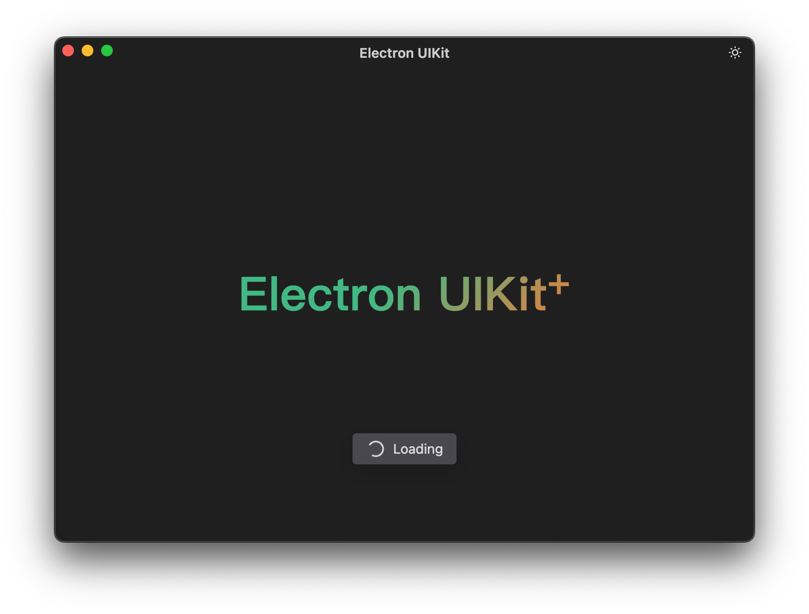

# @electron-uikit/toast


Toast for Electron app.

Toast is a concise, non-modal notification method that is used to briefly display information on the user interface without interrupting the user's current operation. It is widely used in mobile operating systems such as Android and iOS to provide quick feedback and important prompt information. Through toast notifications, developers can improve user experience and effectively communicate application status changes.

<p align='center'>
  
</p>

## Usage

### Install

```sh
npm i @electron-uikit/core @electron-uikit/toast
```

### Get Started

#### Using the toast in the renderer process.

```js
import { toast } from '@electron-uikit/toast/renderer'

toast.text('foo')
toast.loading('loading')
```

#### Using the toast in the main process.

1. Exposes the UI Kit APIs for components. See [@electron-uikit/core](https://github.com/alex8088/electron-uikit/tree/main/packages/core) guide for more details.

   You can expose it in the specified preload script:

   ```js
   import { exposeUIKit } from '@electron-uikit/core/preload'

   exposeUIKit()
   ```

   Or, you can expose it globally in the main process for all renderer processes:

   ```js
   import { useUIKit } from '@electron-uikit/core/main'

   useUIKit()
   ```

> [!NOTE]
> If you are using [@electron-toolkit/preload](https://github.com/alex8088/electron-toolkit/tree/master/packages/preload) to expose Electron APIs, there is no need to use this module, because `core` is also an export of it.

2. Register a listener in the renderer process, so that you can use it in the main process.

   ```js
   import { toast } from '@electron-uikit/toast/renderer'

   toast.config({
     supportMain: true
   })
   ```

3. Use the notification in the main process.

   ```js
   import { BrowserWindow } from 'electron'
   import { Toast } from '@electron-uikit/toast'

   const win = new BrowserWindow()

   const toast = new Toast(win)
   toast.text('foo')
   toast.loading('loading')
   ```

## APIs

> [!NOTE]
> To use Toast in the main process, you need to create a Toast instance of the specified window.

### `.config(options)`

Configure toast defaults or customize toast. Can only be used in the renderer process.

- options: `object`

  - **container**: `HTMLElement` (optional) - Container element of Toast. Default to `document.body`.
  - **duration**: `number` (optional) - Display duration in millisecond. If set to `0`, it will not turn off automatically. Default to `2000`.
  - **customClass**: `string` (optional) - Custom CSS class name for toast.
  - **bottom**: `number` (optional) - Toast position to the bottom. Default to `50`.
  - **maxWidth**: `number` (optional) - The maximum width of toast. Default to `320`.
  - **color**: `string` (optional) - Toast background color.
  - **textColor**: `string` (optional) - Toast text color.
  - **fontSize**: `number` (optional) - Toast font size. Default to `14`.
  - **iconSize**: `number` (optional) - Toast icon size. Default to `20`.
  - **supportMain**: `boolean` (optional) - Support Electron main process. Default to `false`.

### `.text(text[, duration])`

Show text. The default duration is `2000` ms.

### `.loading(text[, duration])`

Show loading. The default duration is 0, which means it is always displayed and can be turned off by calling its return value function.

```js
import { toast } from '@electron-uikit/toast/renderer'

const reply = toast.loading('Loading')

setTimeout(() => {
  reply.success('Successful')
  // reply.fail('Failed')
  // reply.dismiss()
}, 3000)
```

## Customization

1. Customize using CSS classes

```css
.toast {
  --toast-bottom: 50px;
  --toast-z-index: 5001;
  --toast-color: #48484e;
  --toast-text-color: #ffffffd1;
  --toast-font-size: 14px;
  --toast-font-family: -apple-system, BlinkMacSystemFont, Ubuntu, 'Segoe UI';
  --toast-icon-size: 20px;
  --toast-max-width: 320px;
}
```

```js
toast.config({
  customClass: 'toast'
})
```

2.  Customize using `config` API

```js
toast.config({
  bottom: 200,
  maxWidth: 280
})
```
